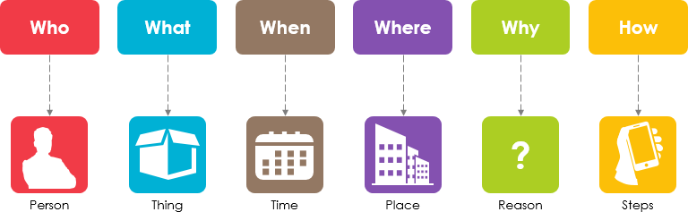

5W1H là viết tắt của những từ "What-Where-Who-When-Why-How" là một kỹ thuật tư duy hay một kỹ năng đặt câu hỏi. Lợi ích của việc sử dụng 5W1H đối với 1 vấn đề, khía cạnh nào đó, là mình chi tiết hóa các khía cạnh của việc đó ra, giúp chúng ta hiểu rõ vấn đề hơn, tư duy, nhận định, quyết định tốt hơn.

Có thể giải thích các từ trong cụm trên theo các ý sau:

  1. What: Vấn đề đặt ra là gì. Cần làm cái gì để đạt được mục tiêu.
  
  2. Where: Vấn đề nằm ở đâu.

  3. Who: Ai là người yêu cầu vấn đề. Ai là người thực hiện. Mục tiêu của chúng ta hướng đến đối tượng nào.

  4. Why: Tại sao vấn đề xảy ra/ tại sao vấn đề quan trọng,...

  5. When: Khi nào thực hiện kế hoạch,...

  6. How: Làm thế nào để thực hiện kế hoạch

- Công cụ này rất phổ biến đối, đặc biệt là đối với các nhà báo, sinh viên, đồng thời cũng được sử dụng và áp dụng cho các bối cảnh khác nhau. Nó sẽ giúp chúng ta đặt câu hỏi phù hợp, mở rộng yêu cầu và có được thông tin phù hợp, chi tiết, toàn diện các khía cạnh, từ đó giúp bạn tìm ra giải pháp tốt nhất. 

- Phương pháp này cho phép ta hướng dẫn tất cả các thành viên trong nhóm của mình và thu thập tất cả các yếu tố thực tế cần thiết để có được sự hiểu biết đầy đủ và khách quan.

-  Như Jean-Pierre Giraud đã trình bày trên blog Những kỹ thuật bán hàng lớn: “Phương pháp 5W1H cho phép bạn phân biệt thông tin cần thiết để hiểu rõ hơn, bao hàm, làm rõ, cấu trúc, định khung một tình huống; vì lối suy nghĩ này cho phép bạn khám phá tất cả các chiều từ các khía cạnh khác nhau ”. 

<h1 align="center"> Phương pháp 5W1H </h1>  

  

## Table of Contents

- [Định nghĩa](#introduction)
- [Ứng dụng](#features)
- [Lợi ích](#feedback)
- [Kế hoạch tương lai](#contributors)

<!-- END doctoc generated TOC please keep comment here to allow auto update -->

## Định nghĩa

5W1H là viết tắt của những từ "What-Where-Who-When-Why-How". Trong đó:
* What: Vấn đề đặt ra là gì. Cần làm gì để đạt được mục tiêu.
* Where: Vấn đề nằm ở đâu. Cách giải quyết vấn đề sẽ được thực hiện ở vị trí nào.
* Who: Ai là người yêu cầu vấn đề, ai là người triển khai kế hoạch. Mục tiêu của chúng ta hướng đến đối tượng nào.
* Why: Tại sao vấn đề xảy ra, tại sao vấn đề quan trọng,...
* When: Khi nào thực hiện kế hoạch. Cách giải quyết vấn đề sẽ được thực hiện vào khoảng thời gian nào.
* How: Vấn đề này xảy ra như thế nào, nó gây ảnh hưởng gì. Làm sao để chúng ta giải quyết vấn đề đó, khi thực hiện sẽ cần những gì, ...
5W1H là một kỹ thuật tư duy hay một kỹ năng đặt câu hỏi. Lợi ích của việc sử dụng 5W1H đối với 1 vấn đề, khía cạnh nào đó, là mình chi tiết hóa các khía cạnh của việc đó ra, giúp chúng ta hiểu rõ vấn đề hơn, tư duy, nhận định, quyết định tốt hơn.

## Ứng dụng

Phương pháp 5W1H có có thể ứng dụng trong nhiều lĩnh vực khác nhau. Nhờ tính đơn giản và tính linh hoạt, với nhiều cấu trúc, cấu hình và vấn đề khác nhau, và vì vậy nó có thể được sử dụng trong mọi tình huống cần giải quyết vấn đề có thể kể đến như: 

* Thiết kế hoặc cải tiến chiến lược.
* Cải tiến tổ chức và quy trình quản lý.
* Xác định các yếu tố chính và ưu tiên chúng trong các vấn đề.
* Thúc đẩy sự xuất hiện của các giải pháp và ý tưởng trong sự nghiệp tiến bộ.
* Đề xuất các hành động phù hợp và quan trọng là hiệu quả.

## Lợi ích

* Học cách đặt vấn đề, học cách đặt câu hỏi từ nhiều mặt khác nhau
* Đặt câu hỏi dẫn đến việc tìm ra được câu trả lời, vì vậy càng nhiều câu hỏi thì sẽ càng nhiều câu trả lời từ đó giúp chúng ta làm rõ và lên được một kế hoạch hoàn thiện cho vấn đề đó

## Kế hoạch tương lai
